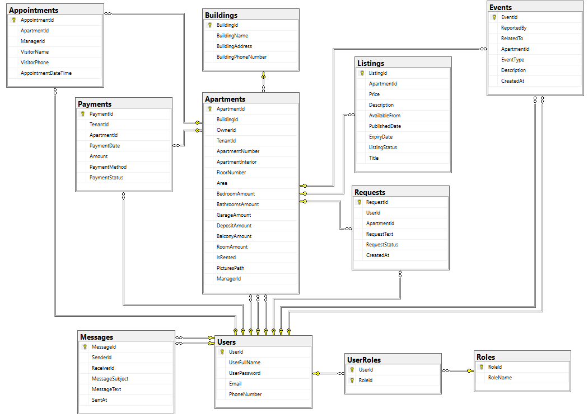

# PROPERTY RENTAL MANAGEMENT SYSTEM - LEASE LINK

## Description

As the name properly describes the objective, the application aims to create a management system for real estate users that facilities the communication between them.

It provides a friendly user interface with organized features such as messages, requests and event reporting, and a platform where property owners and managers can control and offer their apartments to the public.

It is set to be secure and reliable so that all the information is confidential, and users are shown only what the application allows.

### Watch a video

## Development

### For the server side, the application is developed using:

- ASP.NET Core MVC development environment setup using Entity Framework Core with database as first approach.
- SQL server management studio 20.

### For the client side, the application implements diferent tools, such as:

- CSS3
- HTML5
- JavaScript
- jQuery
- Bootstrap for responsive design.

## DB Implementation

The final database result consists of 11 tables being: Users, UserRoles, Roles, Buildings, Apartments, Listings, Messages, Requests, Events, Appointments, Payments.

## Author

- [Andres Bonilla](https://github.com/Andres94b)
